# TraceLock user manual

*Author: Xavier Dobon · Apache 2.0 License*

TraceLock is an incident management and evidence traceability console. It works with three pieces:
the `tracelock.html` file, a case folder and a compatible browser. The whole case lives in that
folder on your disk: the evidence, who holds it, when it was verified, what the team has done and a
chained log that makes any later modification detectable. There is no server, no database and
nothing to install.

The project's source code is split into modules (JavaScript, styles, icons, fonts and colours) that
are assembled into `tracelock.html` at build time; the process is described in `README-build.md`. To
use the tool you only need that built file.

This manual explains how to work with the application, what each section does and, above all, what
to keep in mind so that the resulting case file can be defended. The screenshots show the Spanish
interface; the English interface, selected in **Settings → Language**, has the same layout.

## Contents

- [1 What TraceLock is and is not](#1-what-tracelock-is-and-is-not)
- [2 Requirements](#2-requirements)
- [3 Basic concepts](#3-basic-concepts)
- [4 The case folder](#4-the-case-folder)
- [5 Getting started](#5-getting-started)
  - [5.1 Creating a case](#51-creating-a-case)
  - [5.2 Opening an existing case](#52-opening-an-existing-case)
  - [5.3 Resuming after a page reload](#53-resuming-after-a-page-reload)
  - [5.4 Sample case](#54-sample-case)
  - [5.5 Identifying yourself](#55-identifying-yourself)
- [6 The main screen](#6-the-main-screen)
- [7 Case file](#7-case-file)
  - [7.1 Overview](#71-overview)
  - [7.2 Classification](#72-classification)
  - [7.3 MITRE ATT&CK](#73-mitre-attck)
- [8 Coordinate](#8-coordinate)
  - [8.1 Timeline](#81-timeline)
  - [8.2 Milestones](#82-milestones)
  - [8.3 Open questions](#83-open-questions)
  - [8.4 Notes](#84-notes)
  - [8.5 Total timeline](#85-total-timeline)
- [9 Investigate](#9-investigate)
  - [9.1 Evidence](#91-evidence)
    - [9.1.1 Adding evidence](#911-adding-evidence)
    - [9.1.2 The evidence table](#912-the-evidence-table)
    - [9.1.3 Transfers](#913-transfers)
    - [9.1.4 Read-only protection](#914-read-only-protection)
    - [9.1.5 Automatic verification](#915-automatic-verification)
    - [9.1.6 External seal](#916-external-seal)
  - [9.2 IOCs](#92-iocs)
  - [9.3 Graph](#93-graph)
  - [9.4 Lab](#94-lab)
    - [9.4.1 Operations](#941-operations)
    - [9.4.2 Email analysis](#942-email-analysis)
    - [9.4.3 Reading metadata](#943-reading-metadata)
- [10 Deliver](#10-deliver)
  - [10.1 Export](#101-export)
  - [10.2 Activity log](#102-activity-log)
- [11 Search, Guide and Settings](#11-search-guide-and-settings)
  - [11.1 Search](#111-search)
  - [11.2 Guide and capabilities](#112-guide-and-capabilities)
  - [11.3 Settings](#113-settings)
- [12 Teamwork](#12-teamwork)
- [13 Recommended workflow](#13-recommended-workflow)
- [14 Things to bear in mind](#14-things-to-bear-in-mind)
  - [14.1 Limits of what TraceLock attests](#141-limits-of-what-tracelock-attests)
  - [14.2 What is stored in the browser (and lost when the tab is closed)](#142-what-is-stored-in-the-browser-and-lost-when-the-tab-is-closed)
  - [14.3 Reduced mode (Firefox)](#143-reduced-mode-firefox)
  - [14.4 Privacy](#144-privacy)
  - [14.5 Language](#145-language)
- [15 Troubleshooting](#15-troubleshooting)
- [16 Glossary](#16-glossary)

---

## 1 What TraceLock is and is not

TraceLock is a **rigorous, traceable workbook** for an incident and a basis for writing the report.
It records the intake of each evidence item with its SHA-256 hash and acquisition details; it logs
every verification, every transfer and every action by the team with its time and author; and it
chains all those entries so that any later alteration of the log is detected.

There are things TraceLock does **not** do, and it is worth being clear about them from the start:

- **It does not replace the acquisition record.** Adding an evidence item documents its entry into
  this system, not how it was obtained from the original device. If your acquisition tool gives you
  a hash, record it: it is what ties the copy to the original media.
- **It is not self-standing proof for third parties.** Times come from your computer's clock and
  nobody certifies them, and each analyst types their own name: there is no authentication. That
  would require qualified timestamping and verifiable identity.
- **It does not prevent file changes, it only detects them.** Anyone with write access to the folder
  can change things; TraceLock will warn you, but cannot stop it.
- **It does not replace a write blocker or immutable storage.** The separation between original and
  working copy is logical and documentary.

## 2 Requirements

TraceLock opens from the `tracelock.html` file. You open it with a double click and nothing is
installed.

| Browser | What you can do |
|---|---|
| **Chrome or Edge** | Everything. They are the only browsers that let a web page write to a local folder. |
| **Firefox** | Reduced mode: hashes are calculated, but files are not copied to any folder and the log is kept in the tab. See [14.3 Reduced mode (Firefox)](#143-reduced-mode-firefox). |

*Table 1 – Browser support*

TraceLock makes no external connections: fonts and icons are embedded in the file itself and its
security policy blocks any network request. It works the same offline, and no evidence or case data
leaves your computer. The only outbound actions are the ones you choose, such as opening a lookup
link for an indicator (see [9.2 IOCs](#92-iocs)).

## 3 Basic concepts

**Entry.** Everything that happens in the case (adding an evidence item, starting a milestone,
assessing an indicator…) is written as a line in the `registro.jsonl` file. That line is an entry:
it carries a sequence number, time, author, type and data.

**Chained log.** Each entry includes the SHA-256 hash of the previous one. If someone changes,
deletes or reorders a line, the chain breaks and the application flags it in the status bar.
Everything you see on screen is rebuilt by reading that log: there is no other state.

**Nothing is deleted.** A timeline rectification, the withdrawal of an ATT&CK technique or the
removal of a link between indicators are added as new entries. The original remains in the log.

**External seal.** A snapshot of the state of the log and the evidence, downloaded as a JSON file to
be kept outside the case folder. It detects what the chaining alone cannot: someone rebuilding the
whole log from scratch or truncating it at the end. How to generate and check it: [9.1.6 External
seal](#916-external-seal).

**Original evidence and working copy.** When a file is added, two copies are stored: the original,
which must not be touched, and a working copy.

## 4 The case folder

A case is a folder. Copying it takes the whole case file with it.

```
IR-2026-031-Phishing-Finanzas/
├── registro.jsonl          ← the chained log: the case's source of truth
├── datos-base.json         ← supporting lists (analysts, clients, phases…), editable
├── evidencias/
│   ├── originales/         ← full copy of each evidence item as it came in
│   └── trabajo/            ← working copy of each evidence item
└── acciones/               ← screenshots attached to milestones
```

`acciones/` is kept apart from `evidencias/` on purpose: the screenshots document what the team did,
they are not evidence of the incident. Folder and file names are always in Spanish, whatever the
interface language.

`datos-base.json` is created automatically the first time with default values. You can edit it with
any text editor to adjust the lists the application offers:

| Key | What it is for |
|---|---|
| `organizacion` | Name of your organisation. |
| `analistas` | Names suggested in the analyst fields. |
| `clientes` | Entities suggested when creating a case. |
| `fases` | Milestone phases (default values, in Spanish: Notificación, Contención, Análisis, Mitigación, Recuperación, Cierre). |
| `riesgos` | Milestone risk levels (default values: Bajo, Medio, Alto). |
| `metodosAdquisicion` | Methods suggested when adding evidence. |
| `husos` | Time zones available in the timeline. |

*Table 2 – datos-base.json keys*

If you change the phases, bear in mind that case templates refer to phases by name.

## 5 Getting started

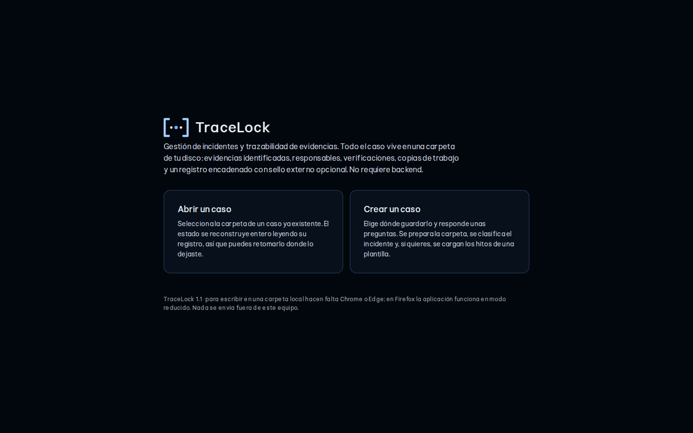

*Figure 1 – Home screen*

When you open the file you will see two options.

### 5.1 Creating a case

1. Click **Create a case** and choose the folder where you want to save it. The case folder will be
   created inside it.
2. **Incident details:** case name or reference, analyst opening it, affected entity, TLP marking,
   detection date and time, and reason for opening. The detection date is the one used to calculate
   the closure deadline, not the date you create the case.
3. **Classification and template:** cyber incident type according to CCN-STIC 817, highest ENS
   category affected, affected devices, estimated resolution effort and, if you wish, a work
   template.

The classification saved at this step is marked as **provisional**: the application assigns the
levels suggested by the guide, without justification. Complete it in **Classification** before
closing the case.

### 5.2 Opening an existing case

Click **Open a case** and select the folder. The state is rebuilt by reading the log, so you pick up
exactly where you left off. On opening, TraceLock also checks the evidence in the background (see
[9.1.5 Automatic verification](#915-automatic-verification)).

### 5.3 Resuming after a page reload

When you reload the page, the browser revokes its permission on the folder: this is a browser
measure that cannot be avoided. If you enable **Remember the case folder** in Settings, the home
screen will show **Resume** and you only need to accept the permission prompt, without looking for
the folder again. Read that setting's warning before enabling it (see [11.3
Settings](#113-settings)).

### 5.4 Sample case

The repository's `ejemplos/` folder contains a complete, fictitious case (a phishing attack with
session theft, handled by two analysts over three days) so you can see what a real case file looks
like before creating your own. Copy the case folder somewhere else and open it: its `README.md`
explains what it contains and what is worth trying. The screenshots in this manual are taken from
that case.

### 5.5 Identifying yourself

When you open a case, TraceLock asks for your name (when creating one, it is part of the form).
Every entry is signed with that name, which appears on the header button. There is no password: it
is a declared signature, not authentication.

## 6 The main screen

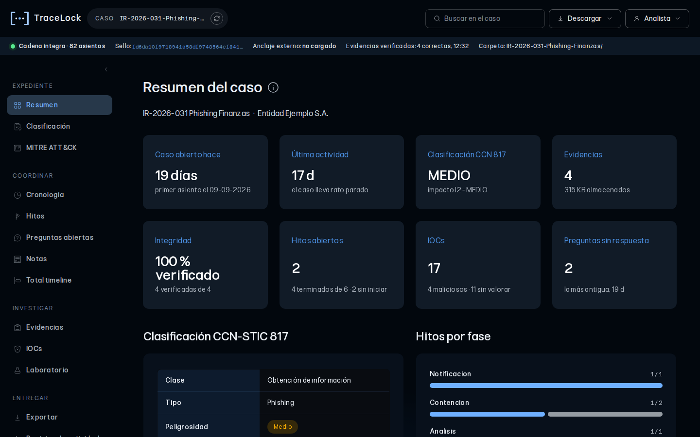

*Figure 2 – Case overview*

**Header.** From left to right: the name of the open case with the **Change case** icon button, the
case file search box, the **Download** menu and the menu with your name.

**Page actions.** The main actions of each section (for example **Add evidence**, **Add fact**,
**Apply template** or **Download CSV**) appear to the right of the title as round buttons with their
name underneath. Some open a drop-down, such as **Other exports**.

**Forms.** The input forms (evidence, facts, milestones, questions, IOCs and notes) open from their
action, inside a card with a title and a close button. They close on their own when you add, and
also with **Cancel** or the **X**. Mandatory fields carry an asterisk (\*). Modal windows close with
the **X** in the corner, with **Escape** or by clicking outside them.

**Tooltips.** The **i** icon next to a title explains that section in more detail.

- **Download** groups the quick downloads. Under **Evidence**: the evidence record and the transfer
  history in CSV, and generating and verifying the external seal. Under **Follow-up**: milestones,
  timeline, questions and total timeline in CSV. Under **Case file**: the complete log.
- The menu with your name contains the affected entity, **Settings** and **Guide and capabilities**.

**Status bar**, just below:

- **Chain intact · N entries** in green, or the entry number where it breaks in red.
- **Seal:** the hash of the last entry.
- **External anchor:** whether you have loaded an external seal and whether it matches the current
  state.
- **Verification indicator** for evidence, while it is running or if it has found something.
  Clicking it takes you to Evidence.

**Side navigation**, in four groups that follow the natural order of the work: **Case file**,
**Coordinate**, **Investigate** and **Deliver**. It can be collapsed with the arrow at the top.

## 7 Case file

The case file gives the overall view of the case: its state calculated from the log, the
classification of the incident under the applicable frameworks and the attacker's techniques
expressed with MITRE ATT&CK.

### 7.1 Overview

Everything shown here is calculated by reading the log: nothing is entered or saved from this
screen. Each card takes you to the corresponding section when clicked.

- **Header indicators:** how many days the case has been open, the team's latest activity, the CCN
  classification, stored evidence, its integrity, open milestones, IOCs and unanswered questions.
- **CCN-STIC 817 classification**, **Milestones by phase** (with the average duration of finished
  milestones and the coverage of the attack timeline), **Evidence integrity** and **Open questions
  by age**.
- **Closure readiness:** a list of completeness checks for the case file (justified classification,
  evidence verified and protected, complete acquisition details, milestones closed, indicators
  assessed, timeline with time zone and source, intact log, external seal…). It shows what is
  **pending** first and what is **completed** next, and it can be collapsed.

> These are completeness checks for the case file, not an assessment of the incident. All of them
> being green does not mean the case can be closed.

### 7.2 Classification

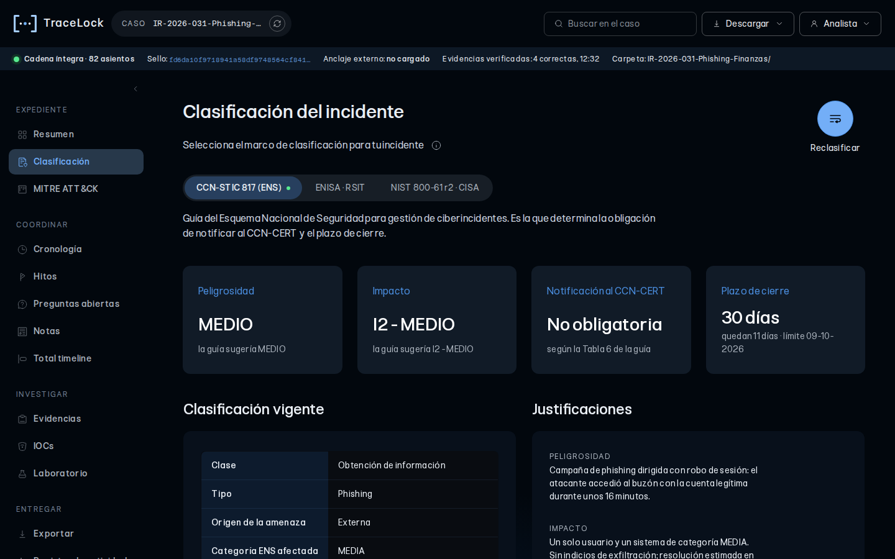

*Figure 3 – Incident classification*

Not every organisation is governed by the same framework, so the incident can be classified under
several at once. Each keeps its own justification and history.

**CCN-STIC 817 (ENS).** This is the one that determines the obligation to notify CCN-CERT and the
closure deadline. Click **Classify or reclassify**:

1. **Step 1:** cyber incident type (table 1 of the guide), threat origin, highest ENS category
   affected, affected devices, affected security dimensions and resolution effort in person-days.
2. **Step 2:** severity and impact level, each with a **mandatory justification**. The application
   shows you what the guide suggests for the step 1 data. It is only a guide: it does not take into
   account reputational, national security or critical infrastructure criteria. Review it and
   justify the level you assign.

By severity level (table 6 of the CCN-STIC 817 guide):

| Severity | Mandatory notification | Closure deadline |
|---|---|---|
| Low | No | 15 calendar days |
| Medium | No | 30 calendar days |
| High | Yes | 45 calendar days |
| Very high | Yes | 90 calendar days |
| Critical | Yes | 120 calendar days |

*Table 3 – Notification and closure deadline by severity (CCN-STIC 817)*

The deadline runs from the detection date given when the case was created; if none was given, from
the first entry. The notification obligation applies to entities within the scope of the ENS
(Spain's National Security Framework) and is made through LUCIA; private entities outside the ENS
notify INCIBE-CERT. Each reclassification is added to the history; the one that counts at closure is
the latest.

**ENISA · RSIT.** The reference taxonomy of European CSIRTs: it classifies the nature of the
incident by its intent. It has no severity scales.

**NIST 800-61 r2 · CISA.** It does not classify the type of incident but how much it affects: attack
vector, functional impact, information impact and recoverability.

### 7.3 MITRE ATT&CK

What the attacker did, expressed in the vocabulary of ATT&CK Enterprise. Each technique is recorded
with **the evidence that supports it, the confidence level** (confirmed, probable or possible) **and
the specific fact that was observed**, not the generic description of the technique.

- **Register technique:** if you have imported the catalogue, the field autocompletes identifiers
  and names; otherwise it is free text.
- **Import catalogue** (optional): TraceLock only includes the 14 tactics of the matrix, not the
  list of techniques. Without a catalogue you can still register techniques, but the identifier and
  name are typed by hand and nothing checks that they exist: a mistyped identifier is saved as it
  is. If you import `enterprise-attack.json`, the official file MITRE publishes in its GitHub
  repository ([mitre-attack/attack-stix-data](https://github.com/mitre-attack/attack-stix-data)),
  the field autocompletes with the official identifiers and names. It is not bundled because it is
  tens of MB in size, MITRE updates it twice a year and TraceLock does not connect to the internet
  to download it. It is only kept while the tab stays open (see
  [14.2](#142-what-is-stored-in-the-browser-and-lost-when-the-tab-is-closed)).
- **Withdraw** (the × button on each row) asks for the reason; the original entry is kept.
- **Download CSV** downloads the techniques table.
- The view shows the **coverage by tactic** across the 14 tactics of the matrix, coloured by
  confidence.

## 8 Coordinate

This is where the team's work is organised and what happened is reconstructed: the attack timeline,
the response milestones, pending questions, quick notes and a view with all the case activity in
order.

### 8.1 Timeline

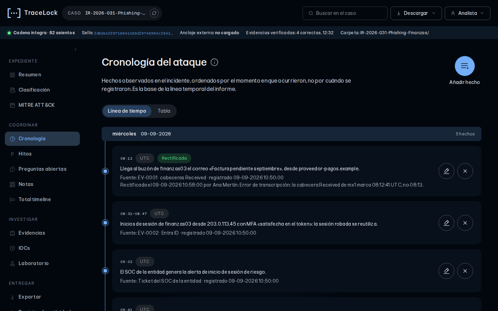

*Figure 4 – Attack timeline*

The facts of the **attack**, reconstructed from the evidence. Not to be confused with the activity
log, which records what the team does.

Each entry has a date, start time (and optional end time), **time zone**, **source** (the log,
artefact or system it comes from) and the observed fact, described without judgement. Give the
actual source of the data, not the note you took it from.

- **Add fact** opens the form for a new entry.
- There are two views: **timeline** and **table**. It is exported with the columns of the report's
  timeline table.
- **Rectify** (pencil) corrects an entry (date, time, time zone), asking for the reason. The
  original entry remains in the log: a rectification adds, it never replaces.
- **Delete** (×) asks for the reason and removes the fact from the timeline and from what is
  exported. It is not erased: it moves to the collapsible **Deleted facts** section, with who, when
  and why.

Choosing the right time zone matters: if a log is in the source system's local time and you mix it
with another in UTC without saying so, the timeline will be wrong. If you do not know it, choose
**Undetermined**; closure readiness will flag it.

### 8.2 Milestones

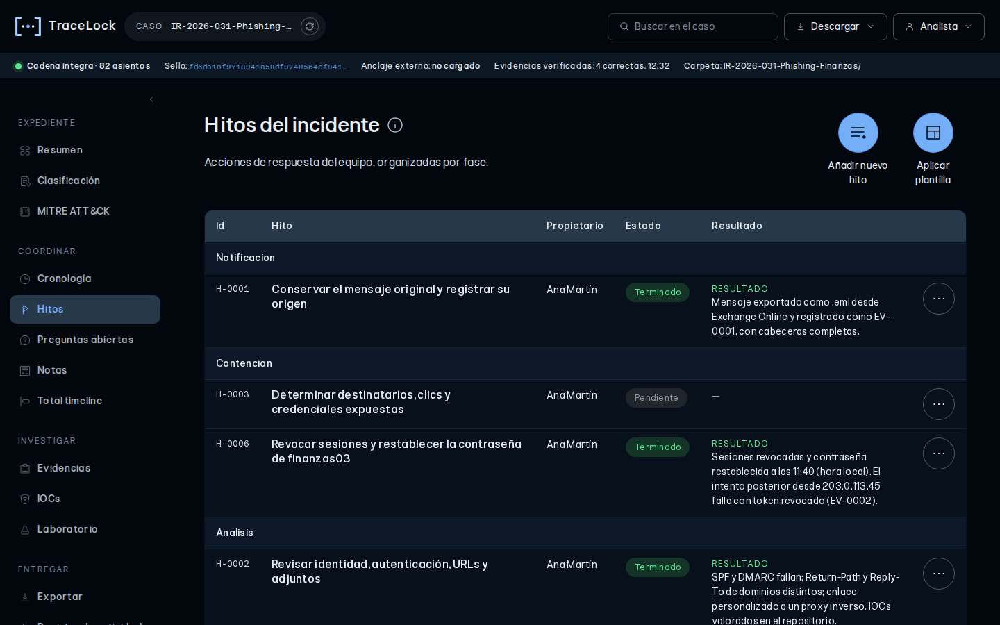

*Figure 5 – Incident milestones*

The team's actions, by phase, with owner and risk. **Times are not typed in**: the start time is
taken when the milestone is started and the end time when you click **Milestone finished**.

- **Add new milestone** opens the form. The **Status** field is mandatory: **Start now** starts the
  clock at that moment and **Pending** leaves it planned, with no clock, until you start it.
  **Cancel** closes the form.
- The table shows the essentials; **click a milestone** to see the full detail: risk, times,
  duration, result or blocker, and the follow-up thread. From there you can **add follow-up**,
  **edit** or **delete** the milestone. Deleted ones stay in the collapsible **Deleted milestones**
  section.
- The actions are in the three-dot menu and depend on the status: pending (start, edit, delete), in
  progress (finish, follow-up, block, edit), blocked (resume, follow-up, edit) and finished
  (follow-up, edit, delete). **Edit** does not touch times or status; **Delete** asks for the reason
  and the milestone remains only in the log.
- When you **finish** you are asked for the result, when you **block** what is missing and who it
  depends on, and a **follow-up** is a dated note. In those three cases you can attach
  **screenshots** of the action: they are saved in `acciones/` with their hash and can be viewed
  from the log.
- **Apply template** creates, in one go, the pending milestones and open questions for a type of
  case. Built-in templates: device compromise, data exfiltration, phishing, business email
  compromise (BEC), ransomware and compromised account. You can load your own in Settings. A
  template does not start any clock or run anything on external systems: it is a work list.

### 8.3 Open questions

What still needs clarifying and who has been asked. They are created with **Add question**; until
answered they appear as **Unanswered**. Phrase them as closed questions that can be marked as
answered. Closing them all before considering the incident closed prevents doubts from ending up
resolved as assumptions in the report. The overview sorts them by age. In each one's three-dot menu:
**Answer** (only if unanswered), **Edit** and **Delete** (with reason). Deleted ones stay in the
collapsible **Deleted questions** section.

### 8.4 Notes

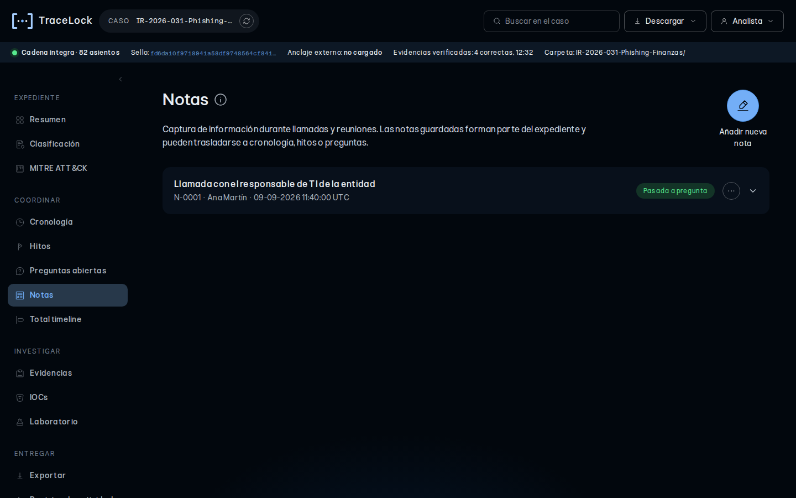

*Figure 6 – Notes*

For writing quickly during a call or a meeting.

- **Add new note** opens the draft.
- **Draft:** scratch paper. **It does not go into the log** and is only kept in this browser tab.
  **Insert timestamp** inserts the current time where you are typing.
- **Save as note:** the note is recorded in the log, with its time and author, exactly as you wrote
  it. Review it first if it contains data you do not want in the case file.
- From a saved note's menu you can **Move to Timeline**, **Move to Milestone** or **Move to
  Question**, **Copy** its text or **Move to draft**.

> The draft is lost when the tab is closed. If it contains anything that matters, save it as a note
> first.

### 8.5 Total timeline

Everything that happened in the case in a single thread: evidence intake and verifications,
milestones and their follow-up, timeline, questions, indicators… in log order, that is, **when each
thing was done**. **Filter** combines a text search and the categories; **Sort by** chooses newest
or oldest first. It can be viewed as a timeline or as a table and exported to CSV.

## 9 Investigate

This section covers the work on the incident material: adding, protecting and verifying evidence,
indicators and their relationships, and the lab for transforming data and analysing emails and
metadata.

### 9.1 Evidence

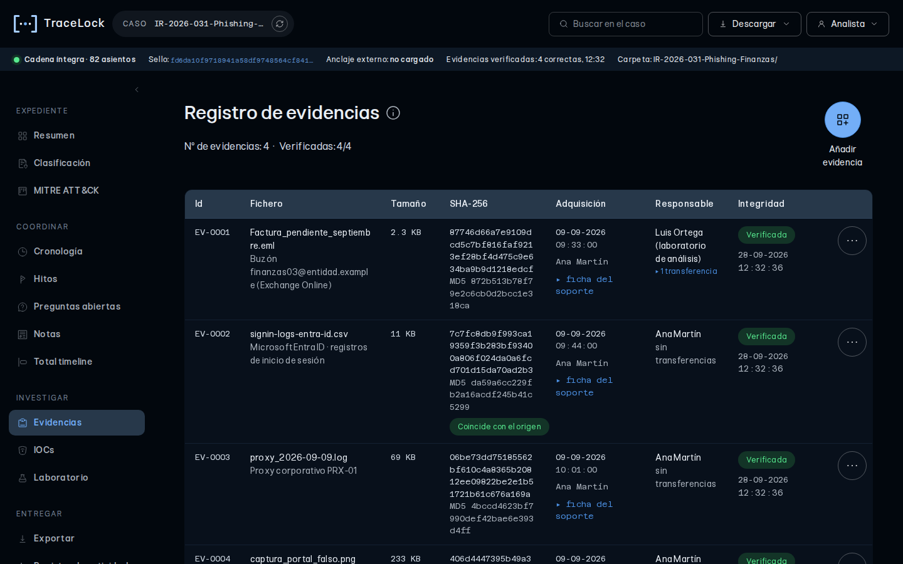

*Figure 7 – Evidence register*

This is where each evidence item is added and everything that happens to it afterwards is
documented: its protection, its verifications, who holds it at each moment and the seal that anchors
its state outside the case folder. Under the title you can see the number of evidence items and how
many are verified.

#### 9.1.1 Adding evidence

1. Click **Add evidence** and, in the form, drop the files onto **Evidence** or click the area to
   select them. They are queued, not added yet.
2. Fill in the **acquisition details**. They apply to the files you drop next.
   - Mandatory, marked with a red \*: evidence **source**, acquisition **method**, **acquired by**,
     **device or media** and **location**. These are the ones TraceLock cannot deduce by reading the
     file; without them the evidence is not added.
   - Optional: acquisition date and time (if left blank, the intake time is used), witness, serial
     number, device user, system state and **SHA-256 declared at source**.
3. Click **Add**. **Cancel** closes the form and discards the queued files.

For each file, TraceLock:

- copies it to `evidencias/originales/` while calculating its SHA-256 and MD5 in blocks, without
  loading it entirely into memory;
- creates the working copy in `evidencias/trabajo/`;
- if you provided a source hash, compares it and, if it does not match, records it with the
  discrepancy noted (do not delete anything: document why it differs);
- warns you if the content is identical to another evidence item already registered;
- records the intake in the log.

A newly added evidence item appears as **Not verified** until its first real verification: the
automatic one when the case is opened or one you launch with **Verify**.

Anything that can be deduced (hash, size, type, the file's own modification date) is calculated
automatically and not asked for.

**If there is unprotected evidence**, a warning appears before intake that makes you decide: confirm
that you have already applied protection, or continue while recording the reason (see [9.1.4
Read-only protection](#914-read-only-protection)).

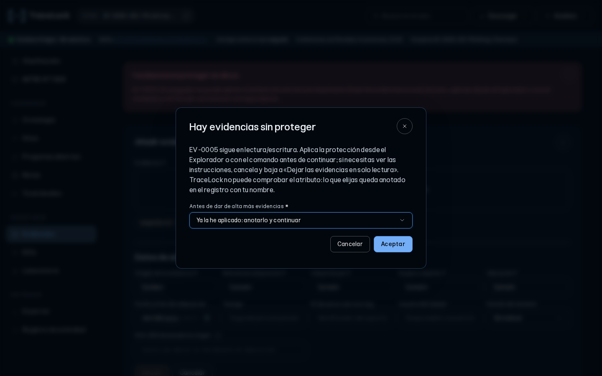

*Figure 8 – Unprotected evidence warning*

#### 9.1.2 The evidence table

Each evidence item shows its hash, acquisition details, current holder and integrity. Its actions
are in the three-dot menu in the last column:

- **Verify:** recalculates the SHA-256 of the original and compares it with the one from intake. The
  result is recorded.
- **Transfer:** records that the evidence passes to another person or body (see [9.1.3
  Transfers](#913-transfers)).
- **Traceability:** shows the full history of the evidence item: intake, verifications, transfers,
  working copy and archiving.

#### 9.1.3 Transfers

The **Transfer** action records who hands over, who receives (\*), the delivery method, the
**reason** (\*), remarks and, if a different copy is handed over, its SHA-256. **A transfer cannot
be undone:** if you make a mistake, record the reverse transfer explaining the error.

#### 9.1.4 Read-only protection

The browser cannot change file system permissions, so making evidence read-only is a manual step
outside TraceLock. It is best done **right after each intake**: every new file comes in as
read-write.

Choose your operating system with the three buttons (**Windows**, **Linux**, **macOS**); the
browser's own system is marked as “this computer”. Each one expands its instructions:

- **Windows.** Option 1, File Explorer (recommended): right-click `evidencias` → **Properties** →
  **Read-only** → OK → **Apply changes to this folder, subfolders and files**. It runs nothing, so
  it works even if the computer blocks scripts. Option 2, command in `cmd`: `attrib +R
  "evidencias\*" /S` (to check: `attrib "evidencias\*" /S`, every line starts with R).
- **Linux.** Terminal open in the case folder: `find evidencias -type f -exec chmod a-w {} +`. It
  only touches files, never folders. To check: `ls -lR evidencias`, every file `-r--r--r--`.
- **macOS.** Option 1, Finder: select the files in `evidencias/originales` (and then `trabajo`),
  **⌥⌘I** and tick **Locked**. Option 2, the same command as on Linux from Terminal.
- Each system has buttons to copy the command and its reverse, plus **downloadable scripts**
  (`proteger.cmd` or `proteger.sh` and their inverses) only if your computer allows running them. On
  managed computers it is common for the security policy to block them: that is an intentional
  control.

Protection only affects the files already in `evidencias/`: you can keep working and adding new
evidence without reverting it. You only need to revert it if you have to write again to an already
protected evidence item, something TraceLock does not do in normal use.

Then click **Protection applied** and state **how** you applied it.

If you cannot apply it, you can continue while recording the reason, but the evidence will still
count as unprotected.

> TraceLock cannot check the read-only attribute: the confirmation is your word, signed with your
> name. And the attribute protects against accidental changes, not against someone who wants to
> alter an evidence item: anyone with access can remove it in two clicks. What proves integrity is
> hash verification.

#### 9.1.5 Automatic verification

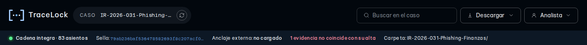

*Figure 9 – Verification indicator showing a discrepancy*

Every time you open or resume a case, TraceLock checks the evidence without you having to do
anything:

1. **Quick check:** compares the size and modification date of each original with those recorded. It
   takes milliseconds and detects almost any accidental write.
2. **Full verification:** recalculates the SHA-256 of all originals in the background. First those
   flagged by the quick check; then from smallest to largest.

Meanwhile you can keep working. The status bar shows progress **by data volume** (not by number of
files, which is misleading: small ones finish at once and large ones are most of the work) and,
after a few seconds, the time remaining. As a reference, in testing a case with 282 evidence items
and 3.1 GB took about 40 seconds; the time grows in proportion to the volume and, on a network
drive, is driven mainly by network speed.

If an evidence item does not match, the indicator turns red as soon as it is detected, the
discrepancy is recorded in the log and you get a warning at the end. **Do not modify or delete that
evidence item: document what happened before going on.** If everything matches, a verification
summary is recorded.

If you close the tab halfway through, that verification is not recorded; it will run again the next
time you open the case.

#### 9.1.6 External seal

Under **Download → Evidence → Generate external seal** you download a JSON file and a text summary
with the state of the log (number of entries and hash of the last one) and the list of evidence
items with their hashes and sizes. The generation is recorded in the log. **Store the JSON outside
the case folder**: in the ticket, in a protected repository or in independent storage. If you leave
it inside, whoever can rebuild the folder could rebuild the seal as well.

To check it, use **Verify external seal** and choose the JSON. TraceLock checks that the seal itself
has not been altered, that the current chain preserves the anchored state and that the evidence
keeps its hash and size. If there is activity after the seal, it says so without treating it as a
failure. A seal cannot be generated while the chain is broken.

The seal is not an identity signature or a third-party timestamp: it is an integrity anchor.

### 9.2 IOCs

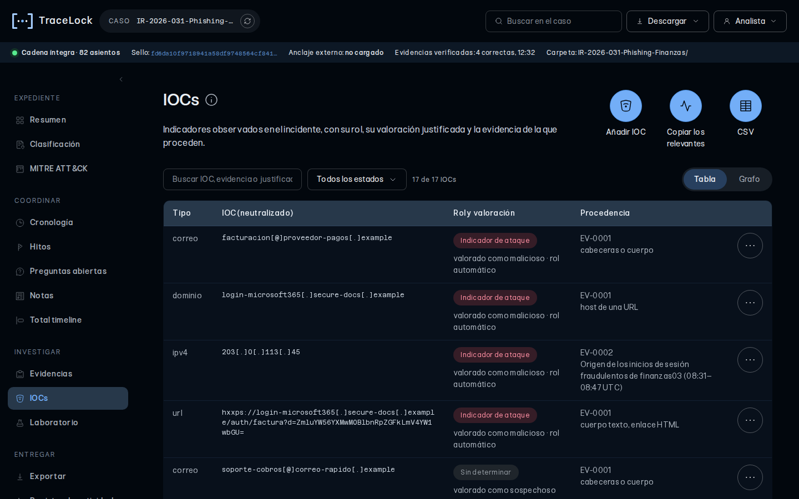

*Figure 10 – Indicator repository (IOCs)*

The case's indicator repository. Indicators are collected automatically when an email is analysed,
tied to the evidence item they come from, and you can also **add them manually** (they are marked as
such).

On screen they are shown **defanged** (`hxxps://`, `example[.]com`) so they are not opened by
accident; exports carry the real value, so it can be used for blocking.

For each indicator, from the three-dot menu in the last column:

- **Assess:** pending, benign, suspicious or malicious, with **mandatory rationale and source**. An
  assessment without a reason cannot be defended in the report.
- **Role:** legitimate asset (the organisation's normal infrastructure that appears in the case
  without being compromised), affected system or attack indicator. An indicator assessed as
  malicious is treated as an attack indicator by default, unless you set another role.
- **Link:** creates a relationship with another artefact, read from this one to the chosen one.
  Attack relationships (has compromised, communicates with, has delivered) and context relationships
  (uses, belongs to, connects to, hosts, resolves to, authenticates on, administers) are drawn
  differently in the graph.
- **Look up:** links to VirusTotal, urlscan or AbuseIPDB that you open yourself.
- **Document:** records the result of an external lookup, with provider, date, result and reference.

> Opening a lookup link reveals the indicator to that service. A URL may contain session
> identifiers, email addresses or personal data of the affected person: review it first. On urlscan,
> a scan may be visible to third parties. TraceLock sends nothing on its own and stores no
> credentials for any service.

**Add IOC** opens the manual input form. **Copy the relevant ones** copies the suspicious and
malicious ones, not defanged; **CSV** exports them all.

The table shows type, value, role and provenance. **Click an IOC** to see its detail: links (with
the option to remove them), rationale and lookups. At the bottom, **Edit** changes both the
assessment and the role, and the three-dot menu has the same actions as the table.

### 9.3 Graph

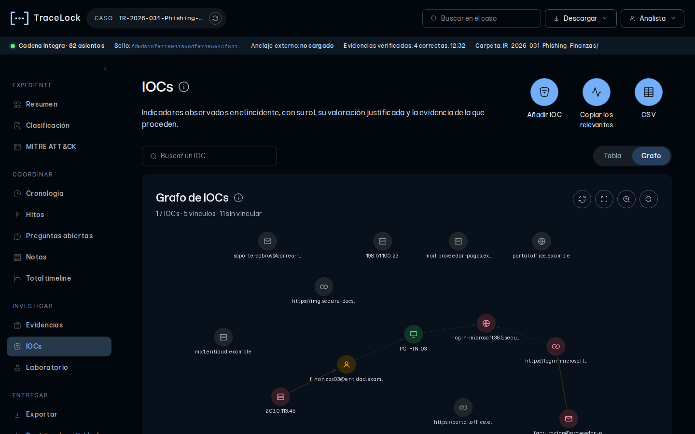

*Figure 11 – Relationship graph*

It sits inside IOCs: the **Table / Graph** switch toggles between the table and the graph. It shows
which indicator has compromised which system, based on the IOCs, their roles and their links. Each
node carries its type icon and the colour of its role (victim, attacker, legitimate asset or
unassigned), as per the legend below. Solid arrows are attack relationships; dashed ones, context.

- Drag a node to place it: it stays fixed where you drop it. A double click releases it.
- Drag the background to pan and use the wheel to zoom in or out.
- The buttons on the right: **Rearrange**, **Fit view**, **Zoom in** and **Zoom out**.
- Clicking a node opens its card (the same information as its table row); it closes when you click
  outside.
- The search box highlights matches as you type and offers results: choosing one centres it and
  opens its card.

Links are not created here, but with the **Link** action of each IOC, in the table or in its card.

### 9.4 Lab

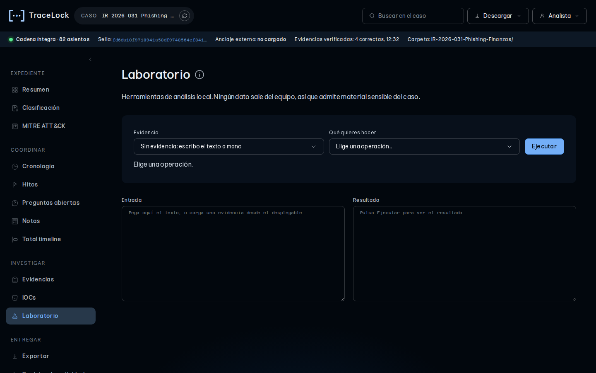

*Figure 12 – Lab*

Transformations and readings on text or on evidence, all on your computer: nothing is sent to any
service. It includes encoding, decoding and extraction operations, email analysis and reading file
metadata.

#### 9.4.1 Operations

1. Choose an evidence item in the drop-down or type the text manually in **Input**.
2. Choose the operation and click **Run**.
3. Operations are not recorded in the log. If a result will support a conclusion, document it where
   appropriate (timeline, milestone follow-up or note). A metadata reading can be recorded, with
   **Record the reading**.

Available operations: decode and encode Base64, hexadecimal and URL; decode Base64 URL and HTML
entities; decode `\u` escapes; ROT13; reverse the text; defang and restore indicators; decode JWT
(without checking the signature); format JSON; unique sorted lines; extract indicators; SHA-256 and
MD5 hashes; lowercase; and remove spaces and line breaks. On evidence, in addition, **analyse
email** and **read metadata** (see [9.4.2](#942-email-analysis) and [9.4.3](#943-reading-metadata)).

**Binary files.** If the chosen evidence item is not text (an image, an executable, an Office
document…), TraceLock works on **its real bytes**: Input only shows a hexadecimal dump of the first
4 KB and cannot be edited. With a binary, only operations that make sense on bytes are allowed
(SHA-256, MD5, hexadecimal, Base64 and extract indicators). Text operations are blocked, because
applying them would require converting the file to text and the result would no longer correspond to
it. For an image or a document, **Read file metadata** is usually the most useful.

**Limits.** At most the first 4 MB of an evidence item are loaded. If the result is very large, the
Result box shows the beginning and offers **Download full result**.

#### 9.4.2 Email analysis

It reads `.eml` and `.msg` files and shows: main headers, delivery chain (`Received` hops with their
delays), authentication results, URLs, IP addresses, servers, attachments, email addresses and the
list of **indicators to review** (Reply-To or Return-Path different from From, display name that
does not match the real address, punycode domains, URL shorteners, double extensions, text-reversal
character…).

To run it, choose a `.eml` or `.msg` evidence item in the drop-down and the **Analyse email (.eml or
.msg)** operation. It does not use the Input box: it works on the evidence item's original file.

The indicators it finds go automatically to the **IOCs** section, tied to that evidence item.

- The email's HTML **is never inserted into the page**: nothing is run and no images are loaded.
- SPF, DKIM and DMARC results are the ones written by the receiving server. They are only reliable
  if you trust the infrastructure that added them; TraceLock does not check them.
- `.msg` files from drafts or sent items do not usually carry transport headers. If that is your
  case, forward the message as an attachment or save it as `.eml` from Outlook.

#### 9.4.3 Reading metadata

**Read file metadata** analyses the original exactly as it is in the case folder: real type
according to its signature versus the declared extension, entropy, EXIF and GPS coordinates of
images, properties and author of Office and PDF documents (with warnings about macros, JavaScript,
automatic actions or embedded objects), executable headers and internal dates. Metadata is written
by the tool that created the file and may be missing, wrong or altered: treat it as one more clue,
never as a proven fact.

## 10 Deliver

Everything needed to take the case out of TraceLock: the documents generated from the case file data
and the activity log exactly as it was written.

### 10.1 Export

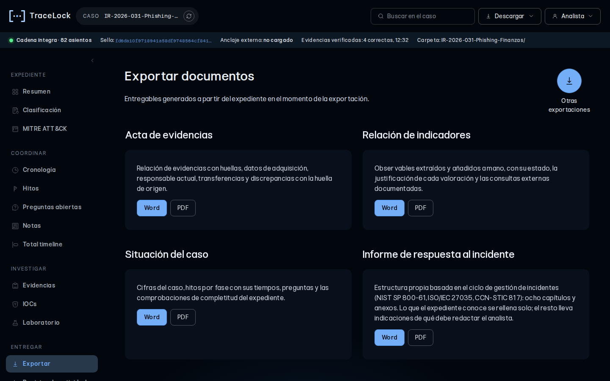

*Figure 13 – Exporting documents*

Documents generated from the case data at the moment you click, in **Word** (editable) or **PDF** (a
print-ready view opens and the browser saves it as PDF):

| Document | Content |
|---|---|
| **Evidence record** | Evidence with hashes, acquisition details, current holder, transfers and discrepancies with the source hash. |
| **List of indicators** | Extracted and manually added indicators, with status, rationale and documented external lookups. |
| **Case status** | Figures, milestones by phase with their times, questions and completeness checks. |
| **Incident response report** | Own structure based on the incident management lifecycle (NIST SP 800-61, ISO/IEC 27035 and CCN-STIC 817): document control, eight chapters (summary, identification, classification and communications, findings, scope of the compromise, response, evidentiary basis and improvement) and annexes. What the case file knows is filled in automatically and the rest carries guidance on what the analyst should write. |

*Table 4 – Exportable documents*

The **custom reports** you define in Settings appear as one more card.

The **Other exports** action opens a drop-down with the raw data for other tools: evidence record,
transfer history, milestones, timeline, IOCs, questions and total timeline in CSV, and the complete
log in JSONL.

Indicator values are exported **not defanged**. Documents are always generated in Spanish and on a
white background, regardless of the interface language.

### 10.2 Activity log

The case entries as they are, from newest to oldest: it is the `registro.jsonl` file without
interpretation. Each line carries the hash of the previous one.

## 11 Search, Guide and Settings

Tools available from any screen: the case file search, the user guide and the application settings.

### 11.1 Search

The header search box searches evidence, indicators, milestones, timeline, questions, classification
and log at the same time. All words are combined with “and”. To narrow by type, add `tipo:` followed
by `evidencia`, `indicador`, `hito`, `cronología`, `pregunta`, `clasificación` or `registro` (the
operators are in Spanish in both interfaces). For example: `tipo:hito bloqueado`.

### 11.2 Guide and capabilities

A summary of how to work with TraceLock, what each function does, under what conditions and what
should not be expected from it. It is worth reading once.

### 11.3 Settings

- **Language:** Spanish or English. English only changes what is displayed: case data, what analysts
  write and exported documents remain in Spanish, and the log always stores the original values.
- **Remember the case folder:** lets you resume with one click after a reload. It is off by default
  because, when the file is opened as `file://`, another HTML file open on the same computer could
  read the folder name and trigger a permission prompt for it. Actually accessing it would still
  require someone to accept that prompt, but if you work with sensitive case files on a shared
  computer, leave it off.
- **Playbooks:** your own case templates. Download the example, edit it and load it. If one of yours
  has the same name as a built-in one, it replaces it.
- **Custom reports:** your own documents combining fixed text, sections for the analyst to fill in
  and data blocks the console fills in automatically. The list of available blocks is in the setting
  itself.
- **Self-diagnosis:** checks that your copy of the file works as it should (hashes against published
  vectors, log chaining, escaping of data from analysed files, format readers, regulatory
  catalogues…). The tests travel inside the HTML: run it on every new computer and before working on
  a real case. **If any test fails, do not use that copy for a real case** until you know why: it
  may be modified or corrupted.

## 12 Teamwork

Several analysts can work on the same case folder, for example on a shared drive, each with their
own copy of `tracelock.html`.

- Each of them must enter **their own name** when opening the case: it is what tells who did what.
- The application checks the log every few seconds and brings in what the others have recorded. It
  tells you how many new entries have arrived and from whom.
- Before writing, it checks that nobody has written in the meantime and verifies what was written
  afterwards. This greatly reduces the risk of overwrites, but it is not a real lock: in very tight
  races, one of the analysts may get an error and have to repeat the action.

## 13 Recommended workflow

1. **Before you start:** run the self-diagnosis in Settings if it is a new computer or a new copy of
   the file. When you open the case, identify yourself with your name.
2. **Create the case** with the real detection date and, if it fits, a template.
3. **Add the evidence** with its acquisition details and, whenever there is one, the source hash.
   **Protect it** right afterwards and confirm it.
4. **Analyse:** emails, lab, metadata. If a lab result supports a conclusion, document it in the
   timeline, in a milestone follow-up or in a note.
5. **Assess the indicators** with their rationale, assign them roles and link them. Document
   external lookups.
6. **Build the timeline** with time zone and source for each fact, and register the ATT&CK
   techniques observed.
7. **Coordinate** with milestones (started and finished at the time, with screenshots where useful)
   and open questions. Use the notes draft during calls and save it as a note.
8. **Classify and justify** under CCN-STIC 817, and under RSIT and CISA if they apply. Check whether
   there is a notification obligation and the closure deadline.
9. **Before closing:** review closure readiness, let the evidence verification finish, generate the
   external seal and store it outside the folder, and export the documents.

## 14 Things to bear in mind

Limits and behaviours of the tool worth knowing before working on a real case: what it attests and
what it does not, what is lost when the tab is closed, how it works in Firefox, what it means for
privacy and what changes with the language.

### 14.1 Limits of what TraceLock attests

- **Times:** they come from the computer's clock; nobody certifies them. If the clock is wrong, so
  are the times in the log.
- **Identity:** the analyst's name is declared. There is no authentication.
- **Log:** it detects modifications, it does not prevent them. Anyone who can write to the file can
  recalculate the whole chain; the external seal, stored outside, is what gives it away.
- **Read-only:** it protects against accidents, not against tampering, and it is not inherited by
  files added later.
- **Quick check:** it does not detect someone who modifies a file and deliberately restores its
  date. The full hash verification does.

### 14.2 What is stored in the browser (and lost when the tab is closed)

For security reasons, TraceLock stores its preferences in the **tab's** storage, not the browser's.
They survive a reload, but **are lost when the tab or the browser is closed**:

- the **notes draft**;
- the language;
- the **playbooks and custom reports** you have loaded;
- the imported **ATT&CK catalogue**;
- in reduced mode (Firefox), **the case log itself**.

Keep the playbook, report and catalogue files somewhere handy so you can load them again, and turn
the draft into a note before closing. The only exception is **Remember the case folder**, which does
persist.

### 14.3 Reduced mode (Firefox)

Firefox does not let a web page write to a local folder. In that case, TraceLock calculates the
evidence hashes but **does not copy the files anywhere**, cannot verify them again and the log lives
in the tab. **Export the log before closing**. To work on a real case, use Chrome or Edge.

### 14.4 Privacy

- External indicator lookups reveal the indicator to the service you open.
- Saved notes and the reasons you write stay in the log forever: there is no way to delete them
  without breaking the chain.
- Email analysis does not load remote images or run anything.

### 14.5 Language

The English interface translates the screen, not the case file. Exported documents are in Spanish:
bear this in mind before delivering a case file to a recipient who does not read Spanish.

## 15 Troubleshooting

**“Open the case folder first”.** You are in Chrome or Edge without a case open. Open or create one.

**“The browser has revoked permission on the case folder”.** This happens after a reload or after
some time. Open the case again (or click Resume, if you have enabled remembering the folder).

**“Cannot write to registro.jsonl”.** The file has become read-only. Evidence protection does not
touch the log, so this is usually due to protection applied by hand to the whole folder or with an
old version of the scripts. Remove the attribute (`attrib -R registro.jsonl` on Windows or `chmod
u+w registro.jsonl` on Linux and macOS) and try again.

**TraceLock cannot read the evidence on Linux or macOS.** Check that protection was applied only to
files and not to folders: TraceLock's command (`find … -type f`) does not touch folders. If someone
removed permissions from `originales/` or `trabajo/`, restore them with `chmod 755
evidencias/originales evidencias/trabajo` inside the case folder.

`proteger.cmd` **does not run.** If Windows shows “Windows protected your PC”, it is the
downloaded-file mark: you can remove it in Properties → Unblock. If it says a policy prevents it or
the antivirus blocks it, it is a restriction set by your organisation: use the File Explorer option
or the command option.

**“Chain broken at entry N”.** Someone or something has modified the log from that entry onwards.
**Do not keep working on that folder** until this is cleared up: compare it with an earlier copy,
with the external seal if you have one, and document what happened.

**“The log is shorter than before or an already observed entry has changed”.** The file has lost
lines or one has changed while you had it open. Review the case before continuing.

**Automatic verification finds evidence that does not match.** The original file has changed since
intake. Do not modify or delete it. Find out what happened (a tool that wrote to it, a backup
restore, a sync error…) and document it.

**“datos-base.json is not valid JSON”.** There is a syntax error in the file, usually an extra comma
or an unclosed quote. Fix it with an editor or delete it so it is regenerated with the default
values.

**Self-diagnosis fails.** Do not use that copy of the file with a real case. Download a clean copy
and run it again.

## 16 Glossary

**Intake.** The entry of an evidence item into the case file.

**Entry.** Each line of the log: an action with its time, author and data.

**Working copy.** Duplicate of the original evidence that can be worked on.

**Evidence holder.** Person or body holding the evidence at any given moment; it changes with each
transfer.

**Hash.** Cryptographic digest of a file. SHA-256 is the one TraceLock uses to prove integrity; MD5
is recorded only for compatibility with other tools.

**Defang.** Writing an indicator so that it cannot be opened by accident: `hxxps://example[.]com`.

**Playbook or case template.** Predefined set of milestones and questions for a type of incident.

**External seal or anchor.** Snapshot of the state of the log and the evidence, kept outside the
case folder to detect rebuilds or truncations of the log.

**TLP.** Traffic Light Protocol: a marking that indicates who the case information may be shared
with (RED, AMBER+STRICT, AMBER, GREEN, CLEAR).
